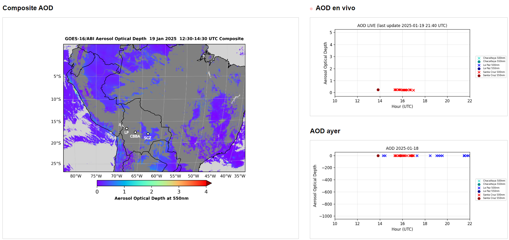

# Automation projects

[Back to Atmospheric Physics Projects](../atmosindex)

These two projects are pretty similar, both use [Github Actions](https://github.com/features/actions) for generating plots and retrieving data from different sources. The advantage of using this tool is that we don't have to have a computer running all the time, and, compared to downloading into a local file, downloading data from the cloud to the cloud (in this case the Github repo) is way quicker (oh, and I forget to mention it's free?).

---
## AOD Plotting
In 2023 and 2024, Bolivia saw an important increase in wildfires[^1], for several days, cities even in the Andes a decrease in air quality, this tool was developed for monitoring the AOD for Bolivia (closely related to emissions from the burning season).

Check out the Github Repo  

**[Check this project running live](https://ludcano.github.io/aod_plotting/)**

This project retrieves data for three places of interest: Mount Chacaltaya (GAW Station), Cota Cota Campus (LFA), and Santa Cruz (UTEPSA), these three locations have an [AERONET Instrument](https://aeronet.gsfc.nasa.gov) that measures AOD, to compare this with a satellite measurement, data from [GOES](https://www.star.nesdis.noaa.gov/goes/index.php) is retrieved and the pixel value for the stations is plotted too. This code runs (almost) 4 times each hour[^2].
All these plots must be saved in the same repository and the time series for future use.

Below an example:

---
## Pluviometry Plotting
Check out the Github Repo  

**[Check this project running live]([https://ludcano.github.io/aod_plotting/](https://github.com/LudCano/pluvio-plots/blob/main/plot_all_cotacota.png?raw=true))**

La Paz is a complicated city, it was built practically above more than 300 rivers. The consequence? In the rainfall season, the bigger rivers become a problem. Also,the  effects of El Niño and Niña in the precipitation per year is still a topic to be fully understood, this small tool retrieves data from two Davis Stations (Campus Cota Cota and on the way to Chacaltaya) and plots the cumulative rainfall and some other event-related plots. This code also runs automatically 3 times per hour [^2].

This project is intended to grow, probably we can retrieve data from cities that don't have professional weather stations using airports' reports? Contact me if you have suggestions! :sweat_smile:

The plot generated:

---
[^1]: Read the [Copernicus Atmosphere Monitoring Service report on wildfires](https://atmosphere.copernicus.eu/cams-global-wildfires-review-2024-harsh-year-americas)
[^2]: Github Actions lets you schedule the times for the code to run, nonetheless this is almost never accomplished, sometimes it can stop working for some hours or not follow the scheduled times.
