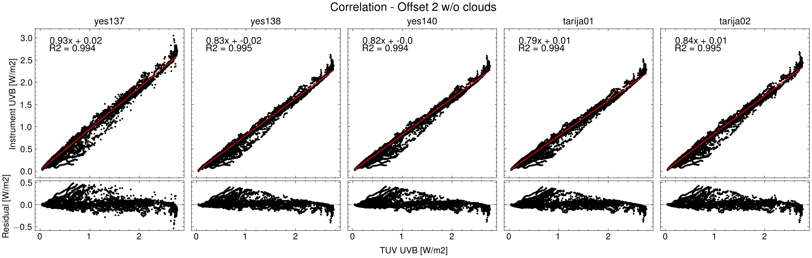

# PYRANOMETER CALIBRATION
[Back to Atmospheric Physics Projects](../atmosindex)

Check out the repository

From June to November 2024, the Laboratory for Atmospheric Physics did a campaign to calibrate 6 pyranometers from Yankee Environmental Systems (YES), these instruments got compared to the Brewer instrument in the roof of the faculty and to the [Tropospheric Ultraviolet and Visible Radiation Model (TUV Model)](https://www2.acom.ucar.edu/modeling/tropospheric-ultraviolet-and-visible-tuv-radiation-model). For this project I was in charge of the analysis and the whole experiment was supervised by different researchers and technicians from the lab.  

In the repository you can find the code and figures generated by it, the data and outputs from the analysis were not uploaded (but they will be), the process is still in discussion and it's planned that we will have a second round of calibration on 2025 (based on the conclusions from this experiment).

The experiment had some difficulties, it's worth mentioning that almost all of the instruments presented electronic noise, then for the first weeks of the calibration, the reference instrument (Brewer) wasn't working properly, and finally, cloudy days limited our experiment. Nonetheless, all these are lessons for the next campaign.

This project was also a chance for me to develop a tool for running the TUV model in batch (normally you would have to enter parameters manually for each day or iteration of the model), now it's only necessary to pass a .csv file with the data and it will run smoothly. This tool is not uploaded to any repository yet but it's planned to get better documentation and be released soon.

