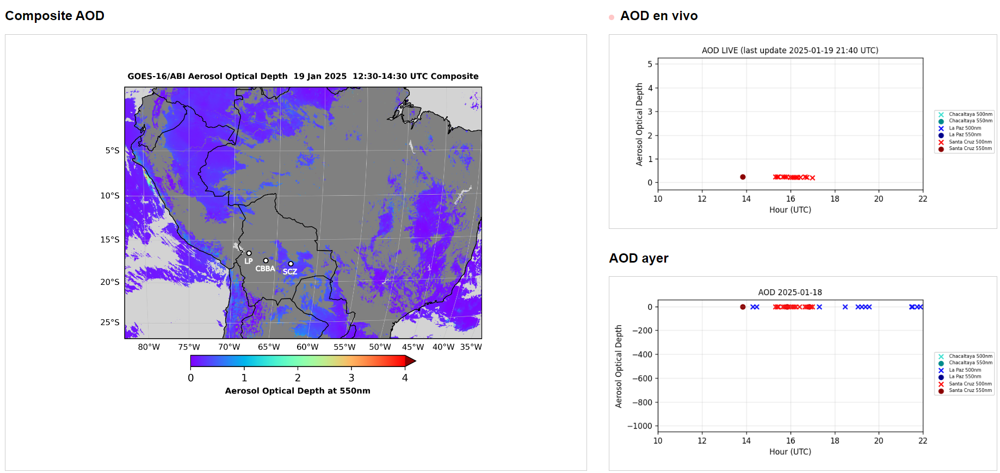
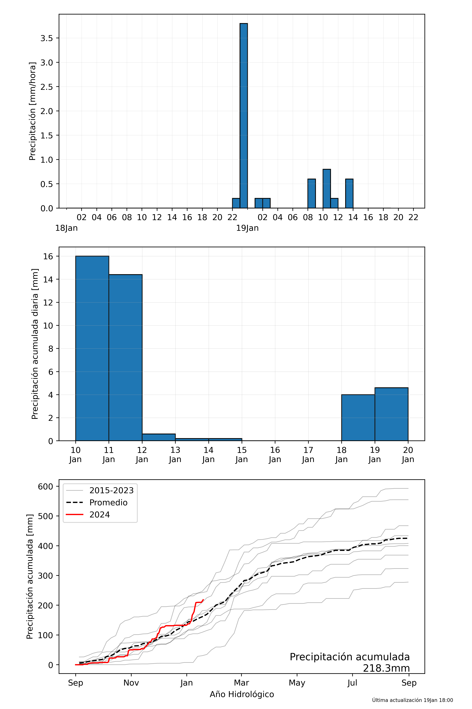
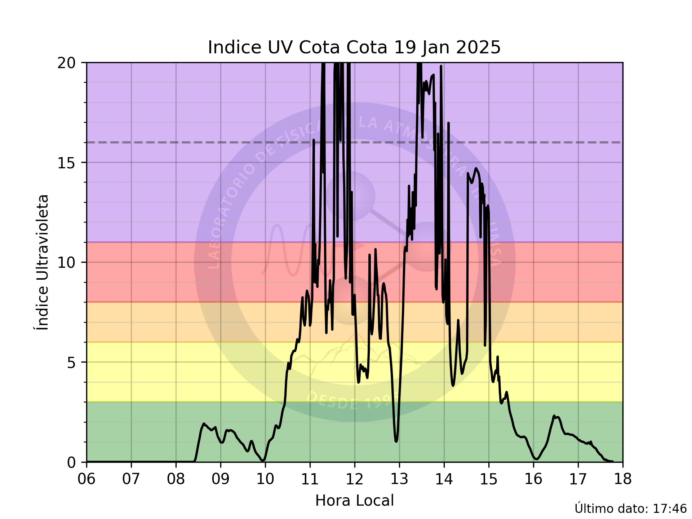
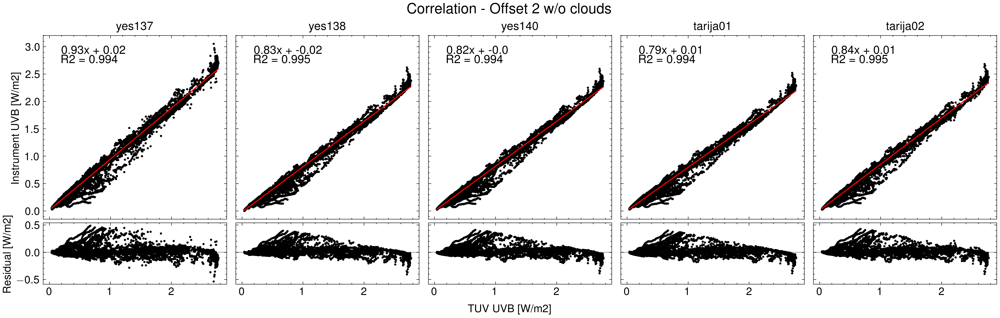

# Atmospheric Physics Projects & Activities
[Back to Main Page](../index)

## 1. LIDAR ANALYSIS LA PAZ (2022 - Present)
[More about the project](/atmos/lidar)
 
I've been developing the data analysis code for the LIDAR instrument located at the UMSA campus.

## 2. AUTOMATION PROJECTS (2024 - Present)
[More about the projects](/atmos/automation)
 
These projects generate automatic plots using GitHub Actions, one is focused on Aerosol Optical Depth, and the other one is in rainfall.

## 3. CALIBRATION OF PYRANOMETERS (2024)
[More about the projects](/atmos/calibrationuv)
 
Analysis of different pyranometers and do a calibration for these instruments combining a reference instrument and a numerical model.

## 4. PYTHON TRAINING FOR DATA ANALYSIS [Educational] (Winter 2024)
[More about the project](/atmos/training)
 
In 2024, I taught Python for Data Analysis to undergraduate students, starting with fundamental Python concepts and progressing to creating complex plots and customizing axes in Matplotlib.
